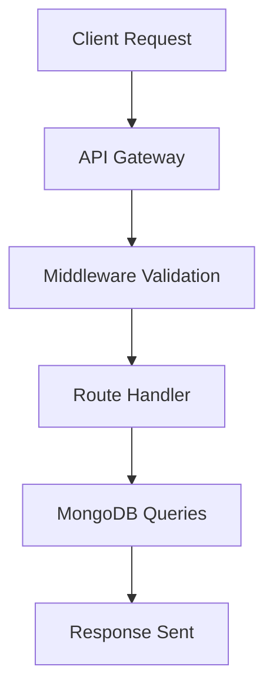
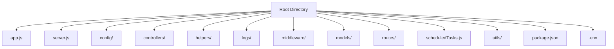

# 🌟 Madhavansh Ayurveda Server 🌟

## Overview

The Madhavansh Ayurveda Server is the backend component of the Madhavansh Ayurveda project. This server is built using **Node.js** and **Express.js**, with **MongoDB** as the database. It handles API requests, executes business logic, and communicates with the database to serve data for the frontend application.

---

## Table of Contents

1. [🚀 Features](#-features)
2. [⚙️ Setup Instructions](#️-setup-instructions)
3. [🗂️ Project Structure](#️-project-structure)
4. [📂 MongoDB Storage Structure](#-mongodb-storage-structure)
5. [🔄 Data Workflow](#-data-workflow)
6. [🖼️ Visual Representations](#️-visual-representations)
7. [🤝 Contributing](#-contributing)
8. [📜 License](#-license)

---



## 🚀 Features

- **User Authentication**: Secure user authentication using JWT.
- **CRUD Operations**: Comprehensive API endpoints for managing data.
- **MongoDB Integration**: Efficient storage and retrieval with Mongoose.
- **Error Handling**: Centralized error management.
- **Scalable Architecture**: Modular design for better maintainability.

---

## ⚙️Setup Instructions

### Prerequisites

- Node.js and npm installed.
- MongoDB running locally or on a cloud provider.

### How to Use

1. Clone the repository:

   ```bash
   git clone <repository_url>
   ```

2. Navigate to the project directory:
   ```bash
   cd madhavansh-ayurveda-server
   ```
3. Install Dependencies
   ```bash
   npm i
   ```
4. Set Environment Variables:
   ```bash
   cd madhavansh-ayurveda-server
   ```
5. Run the server:
   ```bash
   npm run dev
   ```

---

## 🔄 Data Workflow

1. **Client Request**:
   - The frontend sends an API request to the server.
2. **Request Handling**

   - Client sends an API request to the server.
   - The request is routed through the appropriate middleware for validation.

3. **Controller Execution**

   - The relevant controller processes the request.
   - Logic is applied, and database queries are executed.

4. **Database Interaction**

   - MongoDB is queried or updated based on the request.
   - Data is retrieved, created, updated, or deleted.

5. **Response Generation**
   - The server generates a response and sends it back to the client.

---

## 🗂️ Project Structure



---

```plaintext
madhavansh-ayurveda-server/
├── app.js                   # Application entry point
├── server.js                # Main server setup
├── config/                  # Configuration files
├── controllers/             # Handles business logic
├── helpers/                 # Utility functions
├── logs/                    # Log files for debugging
├── middleware/              # Request validation and security
├── models/                  # MongoDB schemas and models
├── routes/                  # API route definitions
├── scheduledTasks.js        # Cron jobs and scheduled tasks
├── utils/                   # Common utility functions
├── package.json             # Project metadata and dependencies
└── .env                     # Environment variables
```

### Description of Key Files and Folders

- **app.js**
  The main entry point of the application. It initializes middleware, routes, and other configurations.

- **server.js**
  Sets up the server to listen for incoming requests.

- **config/**
  Contains configuration files, such as database configurations and environment-specific settings.

- **controllers/**
  Houses the logic for handling API requests and responses.

- **helpers/**
  Contains utility functions that assist various parts of the application.

- **logs/**
  Stores log files for monitoring and debugging server activities.

- **middleware/**
  Includes middleware functions used for request validation, authentication, and other purposes.

- **models/**
  Defines MongoDB schemas and models.

- **routes/**
  Contains the API route definitions that map endpoints to their respective controllers.

- **scheduledTasks.js**
  Manages cron jobs and scheduled tasks for routine operations.

- **utils/**
  Contains reusable utility functions for common tasks across the application.

- **package.json**
  Metadata file for the project, including dependencies and scripts.

- **.env**
  Stores environment variables for sensitive information such as API keys and database credentials.

---

## MongoDB Storage Structure

The MongoDB database is organized into collections, each serving a specific purpose. Below is the storage structure:

### Collections

1. **Users**

   - Stores user details and authentication information.
   - Schema:
     ```json
     {
       "_id": "ObjectId",
       "name": "String",
       "email": "String",
       "password": "String",
       "role": "String",
       "createdAt": "Date",
       "updatedAt": "Date"
     }
     ```

2. **Products**

   - Stores product details for the Ayurveda store.
   - Schema:
     ```json
     {
       "_id": "ObjectId",
       "name": "String",
       "description": "String",
       "price": "Number",
       "stock": "Number",
       "category": "String",
       "createdAt": "Date",
       "updatedAt": "Date"
     }
     ```

3. **Orders**
   - Stores customer orders and their statuses.
   - Schema:
     ```json
     {
       "_id": "ObjectId",
       "userId": "ObjectId",
       "products": [
         {
           "productId": "ObjectId",
           "quantity": "Number"
         }
       ],
       "totalPrice": "Number",
       "status": "String",
       "createdAt": "Date",
       "updatedAt": "Date"
     }
     ```

---

madhavansh-ayurveda-server/
├── app.js # Application entry point
├── server.js # Main server setup
├── config/ # Configuration files
├── controllers/ # Controllers for request handling
├── helpers/ # Helper functions
├── logs/ # Log files
├── middleware/ # Middleware for request validation
├── models/ # MongoDB models
├── routes/ # API routes
├── scheduledTasks.js # Cron jobs and scheduled tasks
├── utils/ # Utility functions
├── package.json # Project metadata and dependencies
└── .env # Environment variables
